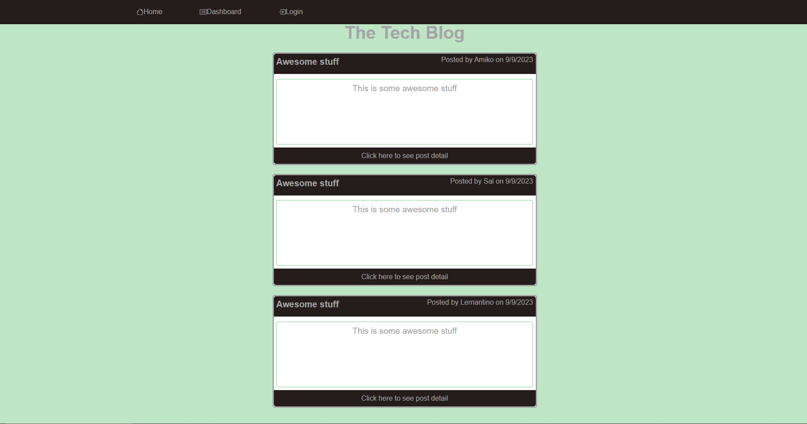
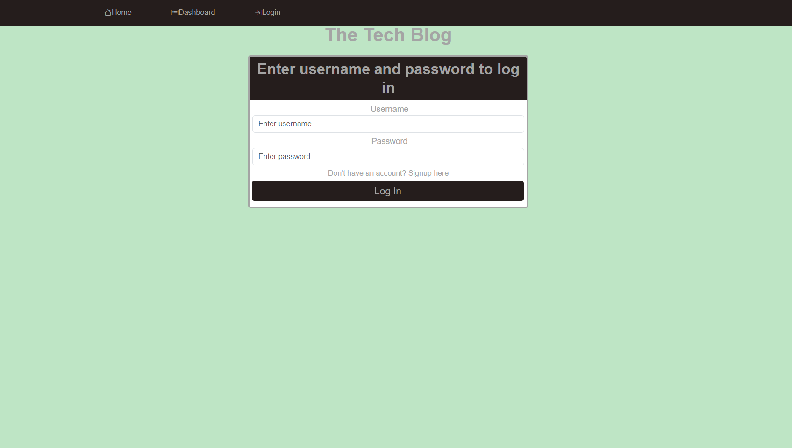
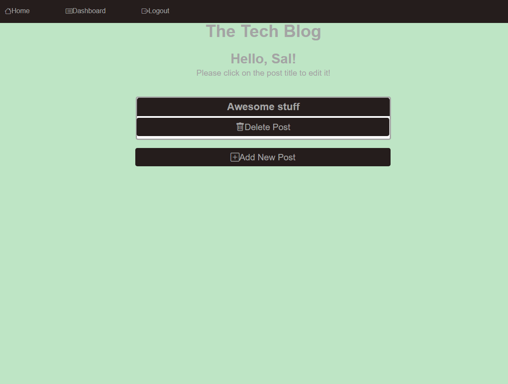
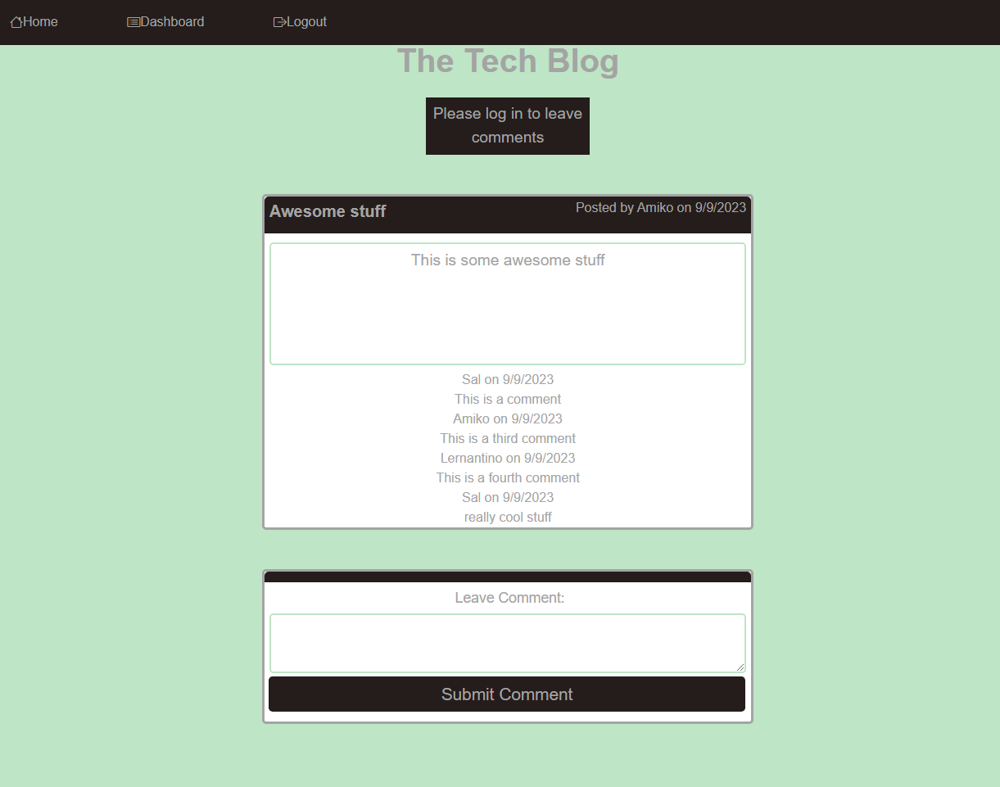

# Model-View-Controller (MVC): Tech Blog


## Description

This is a CMS-style blog site similar to a Wordpress site, where developers can publish their blog posts and comment on other developer's post as well. The app follows the MVC paradigm in its architectural structure, using Handlebars.js as the templating language, Sequalize as the ORM, and express-session npm package for authentification.

When a user visits the site for the first time, they a presented with a homepage the displays blog posts as well as a navigation bar for the homepage, dashboard, and login/sign-up. When a user clicks the homepage, they are redirected to the homepage. Clicking other links in the nav bar also redirects to the appriorate page. When a user signs up, they are prompted to give an email and create, a username and password, which is then saved to the database. Once the user logs in, they can navigate to the homepage to begin viewing other posts and comment on them, or go to the dashboard and create/view their own post.
When a user clicks on an existing post, the post title, contents, post creator's username, and date creation of post are presented, and the user can view and add comments for that post.
When a user enters a comment and clicks submit while signed in, the comment is saved to the post, adn the post display is updated with the new comment with the commentor's username and date posted. When a user goes to the dashboard, they can view and of their post and create a new post by clicking on the new post button. When creating a new post, the user is prompted for a new post title and content to put for the post. Once the user submits the post, the post is saved and the user is redirected to the dashbaord dispalying their new post. Users can also update or delete a post in the dashboard, which refresh with the given changes. Users are also logouted autmatically if sitting idle for too long, which will prevent them from creating post or commenting until they log back in.

## Table of Contents

- [Installation](#installation)
- [Usage](#usage)
- [Contribution](#contribution)
- [Technologies](#technologies)
- [Questions](#questions)
- [License](#license)

## Installation

1. To install just clone this repo:

```
git clone git@github.com:hculp/MVC-tech-blog.git
```

2. Install packages with npm:

```
npm i
```

3. Create a .env file with your mysql information to create and access the database. Make sure to include a session secret as well.
4. Seed your database after adding your protected credentials by running `npm run seed`.

## Usage

To run this app locally just use `npm run start`.
here are some example images of what the site looks like.

This is an image showing the homepage before logging in.


This is an example of the login page.


This is an example of the dashboard after logging in.


This is an example of viewing a post with comments.


The live deployed application can be viewed at this Heroku [link](https://evening-depths-47459-29345061ce44.herokuapp.com/)

## Contribution

Contribution falls under open MIT license.

## Technologies

- Node.js
- Sequalize
- Express.js
- Express Sessions
- Express Handlebars
- MySQL2
- Bcrypt
- Connect-session-sequalize

## Questions

Send any questions or feedback to the following contacts:

- GitHub: [https://github.com/hculp](https://github.com/hculp)
- Email: [howacul@gmail.com](mailto:howacul@gmail.com)

## License

    Copyright (C) 2023 Houston Culpepper.

    Distributed under the MIT License.

[Link to MIT license](https://choosealicense.com/licenses/mit)
